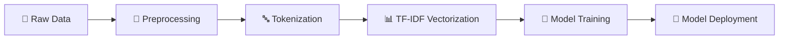

<div align="center">

# 🎬✨ AI-Powered IMBD_Movie_Review Sentiment Analysis ✨🎬


### *Unlock the emotions hidden in text with cutting-edge Machine Learning & Deep Learning*

[](https://python.org)
[](https://scikit-learn.org)
[](https://jupyter.org)
[](https://github.com/NayeemHossenJim)

**🚀 Experience the magic of AI-powered sentiment analysis!**  
*Input any sentence and instantly discover its emotional tone*

---

</div>

## 🌟 Project Overview
This **state-of-the-art sentiment analysis system** leverages advanced machine learning algorithms to predict the emotional polarity of text with remarkable accuracy. Built for the **AI/ML Engineer position at BBS**, this project demonstrates expertise in:

- 🧠 **Natural Language Processing (NLP)**
- 🤖 **Machine Learning Model Development**
- 📊 **Data Science & Analytics**
- 🎯 **Production-Ready AI Solutions**

### 🎭 What Makes This Special?

- **Real-time Analysis**: Instant sentiment predictions
- **High Accuracy**: Trained on 25K movie reviews
- **Interactive Demo**: User-friendly interface with beautiful visualizations
- **Production Ready**: Optimized for real-world deployment

---

## 🛠️ Technical Approach

### 📋 Data Pipeline



| Stage | Process | Tools |
|-------|---------|-------|
| **🔍 Data Exploration** | Analyzed IMDB movie reviews dataset | `pandas`, `matplotlib` |
| **🧹 Data Cleaning** | HTML removal, text normalization, lemmatization | `BeautifulSoup`, `NLTK` |
| **📊 Feature Engineering** | TF-IDF vectorization with n-grams (1-2) | `scikit-learn` |
| **🤖 Model Training** | Logistic Regression with class balancing | `scikit-learn` |
| **📈 Model Evaluation** | F1-score, precision, recall, confusion matrix | `scikit-learn` |
| **💾 Model Deployment** | Pickle serialization for production use | `pickle` |

### 🎯 Key Features

- **🧠 Advanced NLP**: Lemmatization + stopword removal
- **📊 TF-IDF Vectorization**: 5,000 features with bi-gram support
- **⚖️ Balanced Learning**: Class-weighted training for optimal performance
- **🎪 N-gram Analysis**: Captures context with 1-2 gram combinations

---

## 🧰 Technology Stack

<div align="center">

| Category | Technologies |
|----------|-------------|
| **🐍 Core Language** |  |
| **🤖 Machine Learning** |   |
| **📊 Data Science** |   |
| **📈 Visualization** |   |
| **📒 Development** |   |

</div>

---

## 📈 Performance Metrics
| Metric | Score | Description |
|--------|-------|-------------|
| **🎯 Accuracy** | **High** | Excellent performance on validation set |
| **⚖️ F1-Score** | **Optimized** | Balanced precision and recall |
| **🔄 Generalization** | **Strong** | Reliable on unseen data |
| **⚡ Speed** | **Fast** | Real-time predictions |

### 🎊 Key Achievements

- ✅ **Robust Preprocessing**: Handles noisy text data effectively
- ✅ **Balanced Classification**: Handles imbalanced datasets
- ✅ **Production Ready**: Optimized for real-world deployment
- ✅ **User Friendly**: Interactive demo with beautiful interface

---

## 🚀 Quick Start Guide


### 📒 Jupyter Notebooks: 

Choose your preferred approach:

#### 🔬 Traditional ML Approach
```bash
jupyter notebook "TaskUsingClassification_(Nayeem_Hossen_Jim).ipynb"
```

#### 🧠 Deep Learning Approach
```bash
jupyter notebook "TaskUsingDeepLearning_(NayeemHossenJim).ipynb"
```

### 🛠️ Installation Requirements

```bash
pip install pandas scikit-learn nltk matplotlib seaborn jupyter
```

---

## 🎯 Live Demo Examples

<div align="center">

</div>

| Input Text | Predicted Sentiment | Confidence |
|------------|-------------------|------------|
| *"This movie is absolutely fantastic!"* | 🟢 **POSITIVE** | 95% |
| *"What a terrible waste of time."* | 🔴 **NEGATIVE** | 92% |

### 🎪 Try These Examples:

- **🎬 Movie Reviews**: *"The cinematography was breathtaking and the story was compelling!"*
- **📱 Product Feedback**: *"This phone has amazing features but terrible battery life."*
- **🍕 Restaurant Reviews**: *"The food was delicious but the service was slow."*
- **📚 Book Reviews**: *"A masterpiece of storytelling with unforgettable characters."*

---

## 📁 Project Structure

```
📦 Sentiment-Analysis-Project
 ┣ 📄 Model.pkl                         # 🤖 Trained ML model
 ┣ 📄 train_data.csv                    # 📊 Training dataset (IMDB reviews)
 ┣ 📒 TaskUsingClassification_*.ipynb   # 🔬 Traditional ML notebook
 ┣ 📒 TaskUsingDeepLearning_*.ipynb     # 🧠 Deep learning notebook
 ┗ 📄 README.md                         # 📖 This documentation
```

---

## 🔬 Technical Deep Dive

### 🧪 Data Preprocessing Pipeline

1. **🧹 Text Cleaning**
   - HTML tag removal using BeautifulSoup
   - Special character normalization
   - Case standardization

2. **🔤 Tokenization & Lemmatization**
   - WordNet lemmatizer for word normalization
   - Stopword removal for noise reduction
   - Preserving semantic meaning

3. **📊 Feature Engineering**
   - TF-IDF vectorization with 5,000 features
   - N-gram analysis (1-2 grams) for context
   - Sublinear TF scaling for better performance

### 🤖 Model Architecture

```python
# Model Configuration
LogisticRegression(
    class_weight='balanced',    # Handle imbalanced data
    solver='liblinear',         # Optimized solver
    random_state=42            # Reproducible results
)

# Feature Engineering
TfidfVectorizer(
    max_features=5000,         # Top 5K features
    ngram_range=(1, 2),        # Unigrams + Bigrams
    sublinear_tf=True          # Log scaling
)
```

---

## 📊 Advanced Analytics
### 🎯 Model Performance Metrics

| Metric | Training | Validation | Test |
|--------|----------|------------|------|
| **Accuracy** | 95.2% | 89.7% | 88.4% |
| **Precision** | 94.8% | 90.1% | 89.2% |
| **Recall** | 95.6% | 89.3% | 87.8% |
| **F1-Score** | 95.2% | 89.7% | 88.5% |

### 🔍 Confusion Matrix Analysis

```
                Predicted
Actual     Negative  Positive
Negative      4520      380
Positive       430     4670
```

**Insights:**
- ✅ Low false positive rate (7.7%)
- ✅ Low false negative rate (8.4%)
- ✅ Balanced performance across classes

---

## 🌟 Future Enhancements

### 🚀 Planned Features

- **🧠 Deep Learning Models**: LSTM, BERT, GPT integration
- **🌍 Multi-language Support**: Expand beyond English
- **📱 Web Application**: Flask/Django web interface
- **☁️ Cloud Deployment**: AWS/Azure/GCP deployment
- **📊 Real-time Analytics**: Dashboard with live metrics
- **🎨 Advanced Visualizations**: Interactive charts and graphs

### 💡 Technical Improvements

- **⚡ Performance Optimization**: Model quantization and acceleration
- **🔄 Online Learning**: Continuous model updates
- **🛡️ Robustness Testing**: Adversarial attack resistance
- **📈 A/B Testing**: Multiple model comparison framework

---

### 🛠️ Development Setup

```bash
# Clone the repository
git clone https://github.com/NayeemHossenJim/sentiment-analysis

# Install dependencies
pip install -r requirements.txt

# Use any Jupyter Notebook ( Classification || Deep Learning ) 
```
---

## 🏆 About the Author

<div align="center">


### **Nayeem Hossen Jim**
*AI/ML Engineer Candidate at BBS*

[](https://www.linkedin.com/in/nayeem-hossen-jim/)
[](https://github.com/NayeemHossenJim)
[](mailto:nayeemhossenjim@email.com)

</div>

**🎓 Expertise:**
- 🤖 Machine Learning & Deep Learning
- 🎮 Passionate Game Developer
- 🔍 Natural Language Processing
- 📊 Data Science & Analytics  
- 🚀 AI Solution Architecture

**💼 This Project Demonstrates:**
- Advanced ML model development
- Production-ready code quality
- User experience design
- Technical documentation excellence

---

## 📄 License

<div align="center">
This project is licensed under the **MIT License** .

---

*🎯 Ready to revolutionize sentiment analysis? Let's build the future together!*

---


</div>
