<div align="center">

# 🎬✨ IMDB Movie Review Sentiment Analysis ✨🎬


### *Unlock the emotions hidden in text with cutting-edge Machine Learning & Deep Learning*

[](https://python.org)
[](https://scikit-learn.org)
[](https://jupyter.org)
[](https://github.com/NayeemHossenJim)

**🚀 Experience the magic of AI-powered sentiment analysis!**  
*Input any sentence and instantly discover its emotional tone*

---

</div>

## 🌟 Project Overview
This **comprehensive sentiment analysis system** demonstrates two distinct approaches to IMDB movie review classification, showcasing both traditional machine learning and modern deep learning techniques. Built for the **AI/ML Engineer position at BBS**, this project demonstrates expertise in:

- 🧠 **Natural Language Processing (NLP)**
- 🤖 **Traditional Machine Learning (Logistic Regression + TF-IDF)**
- 🚀 **Deep Learning (BERT Transformer Model)**
- 📊 **Data Science & Advanced Analytics**
- 🎯 **Production-Ready AI Solutions**

### 🎭 What Makes This Special?

- **Dual Approach**: Compare traditional ML vs. state-of-the-art BERT
- **High Performance**: 95.65% accuracy with deep learning approach
- **Real Dataset**: Trained on authentic IMDB movie reviews
- **Production Ready**: Both models optimized for deployment
- **Comprehensive Analysis**: Detailed performance comparison and insights

---

## 🛠️ Technical Approach

### 📋 Dual Model Pipeline

```mermaid
graph LR
    A[📄 IMDB Dataset] --> B[🧹 Text Preprocessing]
    B --> C{� Model Choice}
    C -->|Traditional ML| D[📊 TF-IDF Vectorization]
    C -->|Deep Learning| E[🤖 BERT Tokenization]
    D --> F[🎯 Logistic Regression]
    E --> G[🧠 BERT Classification]
    F --> H[💾 Model Deployment]
    G --> H
```



### 🔬 Traditional ML Approach

| Stage | Process | Implementation |
|-------|---------|----------------|
| **🧹 Data Cleaning** | HTML removal, text normalization | `BeautifulSoup`, `regex` |
| **🔤 Text Processing** | Lemmatization, stopword removal | `NLTK WordNetLemmatizer` |
| **📊 Feature Engineering** | TF-IDF vectorization (5000 features, 1-2 grams) | `scikit-learn TfidfVectorizer` |
| **🤖 Model Training** | Logistic Regression with balanced classes | `LogisticRegression(class_weight='balanced')` |
| **📈 Evaluation** | Accuracy, F1-score, confusion matrix | `scikit-learn metrics` |

### 🧠 Deep Learning Approach

| Stage | Process | Implementation |
|-------|---------|----------------|
| **🚀 Model Architecture** | Pre-trained BERT base uncased | `transformers BertForSequenceClassification` |
| **� Tokenization** | BERT tokenizer with 256 max length | `BertTokenizer.from_pretrained` |
| **⚡ Optimization** | AdamW optimizer, 2e-5 learning rate | `torch.optim.AdamW` |
| **🎯 Training** | Single epoch with batch size 32 | `DataLoader, TensorDataset` |
| **📊 Evaluation** | GPU-accelerated inference | `torch.cuda` support |

---

## 🧰 Technology Stack

<div align="center">

| Category | Traditional ML | Deep Learning |
|----------|----------------|---------------|
| **🐍 Core Language** |  |  |
| **🤖 ML Framework** |  |  |
| **🧠 NLP Libraries** |  |  |
| **📊 Data Processing** |   |  |
| **📈 Visualization** |  |   |
| **⚡ Acceleration** | CPU Optimized |  GPU Support |
| **💾 Model Storage** |  |  |

</div>

### 🔧 Key Technical Components

#### 🔬 Traditional ML Stack:
- **Text Processing**: `NLTK WordNetLemmatizer`, `BeautifulSoup` for HTML cleaning
- **Feature Engineering**: `TfidfVectorizer` with 5000 features, n-grams (1,2)
- **Classification**: `LogisticRegression` with balanced class weights
- **Evaluation**: `sklearn.metrics` for comprehensive analysis

#### 🧠 Deep Learning Stack:
- **Model Architecture**: `BERT-base-uncased` pre-trained transformer
- **Tokenization**: `BertTokenizer` with 256 max sequence length
- **Training**: `AdamW` optimizer, learning rate 2e-5
- **Hardware**: CUDA-enabled GPU acceleration for faster training

---

## 📈 Performance Metrics

### 🔬 Traditional ML Model (Logistic Regression)
| Metric | Score | Description |
|--------|-------|-------------|
| **🎯 Accuracy** | **88.50%** | Strong performance on test set |
| **⚖️ F1-Score** | **88-89%** | Balanced precision and recall |
| **🔄 Precision** | **88-89%** | Low false positive rate |
| **⚡ Recall** | **88-89%** | Good true positive detection |

### 🧠 Deep Learning Model (Neural Network)
| Metric | Score | Description |
|--------|-------|-------------|
| **🎯 Accuracy** | **95.65%** | Excellent performance on test set |
| **⚖️ F1-Score** | **96%** | Outstanding precision-recall balance |
| **🔄 Precision** | **95-96%** | Very low false positive rate |
| **⚡ Recall** | **95-96%** | Excellent true positive detection |

### 🎊 Key Achievements

- ✅ **Robust Preprocessing**: Handles noisy text data effectively
- ✅ **Balanced Classification**: Handles imbalanced datasets
- ✅ **Production Ready**: Optimized for real-world deployment
- ✅ **User Friendly**: Interactive demo with beautiful interface

---

## 🚀 Quick Start Guide


### 📒 Jupyter Notebooks: 

Choose your preferred approach:

#### 🔬 Traditional ML Approach
```bash
jupyter notebook "IMDB_MovieReview_ML.ipynb"
```

#### 🧠 Deep Learning Approach
```bash
jupyter notebook "IMDB_MovieReview_DL.ipynb"
```

### 🛠️ Installation Requirements

```bash
pip install -r requirements.txt
```

---

## 🎯 Live Demo Examples

<div align="center">

</div>

| Input Text | Predicted Sentiment |
|------------|-------------------|
| *"This movie is absolutely fantastic!"* | 🟢 **POSITIVE** |
| *"What a terrible waste of time."* | 🔴 **NEGATIVE** |

### 🎪 Try These Examples:

- **🎬 Movie Reviews**: *"The cinematography was breathtaking and the story was compelling!"*
- **📱 Product Feedback**: *"This phone has amazing features but terrible battery life."*
- **🍕 Restaurant Reviews**: *"The food was delicious but the service was slow."*
- **📚 Book Reviews**: *"A masterpiece of storytelling with unforgettable characters."*

---

## 📁 Project Structure

```
📦 IMDB-Movie-Review-Sentiment-Analysis
 ┣ 📄 Model_ML.pkl                      # 🤖 Trained ML model  
 ┣ 📄 train_data.csv                    # 📊 Training dataset (IMDB reviews)
 ┣ 📒 IMDB_MovieReview_ML.ipynb         # 🔬 Traditional ML notebook
 ┣ 📒 IMDB_MovieReview_DL.ipynb         # 🧠 Deep learning notebook
 ┣ 📄 requirements.txt                  # 📋 Python dependencies
 ┗ 📄 README.md                         # 📖 This documentation
```

---

## 🔬 Technical Deep Dive

### 🧪 Data Preprocessing Pipeline

1. **🧹 Text Cleaning**
   - HTML tag removal using BeautifulSoup
   - Special character normalization
   - Case standardization

2. **🔤 Tokenization & Lemmatization**
   - WordNet lemmatizer for word normalization
   - Stopword removal for noise reduction
   - Preserving semantic meaning

3. **📊 Feature Engineering**
   - TF-IDF vectorization with 5,000 features
   - N-gram analysis (1-2 grams) for context
   - Sublinear TF scaling for better performance

### 🤖 Model Architecture

```python
# Model Configuration
LogisticRegression(
    class_weight='balanced',    # Handle imbalanced data
    solver='liblinear',         # Optimized solver
    random_state=42            # Reproducible results
)

# Feature Engineering
TfidfVectorizer(
    max_features=5000,         # Top 5K features
    ngram_range=(1, 2),        # Unigrams + Bigrams
    sublinear_tf=True          # Log scaling
)
```

---

## 📊 Advanced Analytics

### 🎯 Model Performance Comparison

| Metric | ML Model | Deep Learning | Winner |
|--------|----------|---------------|---------|
| **Accuracy** | 88.50% | 95.65% | 🧠 **DL** |
| **Precision (Neg)** | 89% | 96% | 🧠 **DL** |
| **Precision (Pos)** | 88% | 95% | 🧠 **DL** |
| **Recall (Neg)** | 88% | 95% | 🧠 **DL** |
| **Recall (Pos)** | 89% | 96% | 🧠 **DL** |
| **F1-Score** | 88-89% | 96% | 🧠 **DL** |

### 🔍 Confusion Matrix Analysis

#### 🔬 Traditional ML Model (5,000 samples)
```
                Predicted
Actual     Negative  Positive
Negative      2189      311
Positive       264     2236
```

#### 🧠 Deep Learning Model (25,000 samples)
```
                Predicted
Actual     Negative  Positive
Negative     11917      583
Positive       505    11995
```

**Key Insights:**
- ✅ **Deep Learning superiority**: 7.15% higher accuracy than traditional ML
- ✅ **Low False Positive Rate**: ML (12.4%), DL (4.7%)
- ✅ **Low False Negative Rate**: ML (10.6%), DL (4.0%)
- ✅ **Balanced Performance**: Both models perform well across positive and negative classes
- ✅ **Scalability**: Deep learning model trained on 5x more data with better results

---

## 🌟 Future Enhancements

### 🚀 Planned Features

- **🧠 Deep Learning Models**: LSTM, BERT, GPT integration
- **🌍 Multi-language Support**: Expand beyond English
- **📱 Web Application**: Flask/Django web interface
- **☁️ Cloud Deployment**: AWS/Azure/GCP deployment
- **📊 Real-time Analytics**: Dashboard with live metrics
- **🎨 Advanced Visualizations**: Interactive charts and graphs

### 💡 Technical Improvements

- **⚡ Performance Optimization**: Model quantization and acceleration
- **🔄 Online Learning**: Continuous model updates
- **🛡️ Robustness Testing**: Adversarial attack resistance
- **📈 A/B Testing**: Multiple model comparison framework

---

### 🛠️ Development Setup

```bash
# Clone the repository
git clone https://github.com/NayeemHossenJim/Task-Assignment-AI-ML-Engineer-Position-at-BBS

# Navigate to project directory
cd Task-Assignment-AI-ML-Engineer-Position-at-BBS

# Install dependencies
pip install -r requirements.txt

# Launch Jupyter Notebook for ML approach
jupyter notebook IMDB_MovieReview_ML.ipynb

# Or launch Deep Learning approach
jupyter notebook IMDB_MovieReview_DL.ipynb
```
---

## 🏆 About the Author

<div align="center">


### **Nayeem Hossen Jim**
*AI/ML Engineer Candidate at BBS*

[](https://www.linkedin.com/in/nayeem-hossen-jim/)
[](https://github.com/NayeemHossenJim)
[](mailto:nayeemhossenjim@email.com)

</div>

**🎓 Expertise:**
- 🤖 Machine Learning & Deep Learning
- 🎮 Passionate Game Developer
- 🔍 Natural Language Processing
- 📊 Data Science & Analytics  
- 🚀 AI Solution Architecture

**💼 This Project Demonstrates:**
- Advanced ML model development
- Production-ready code quality
- User experience design
- Technical documentation excellence

---

## 📄 License

<div align="center">
This project is licensed under the **MIT License** .

---

*🎯 Ready to revolutionize sentiment analysis? Let's build the future together!*

---


</div>
